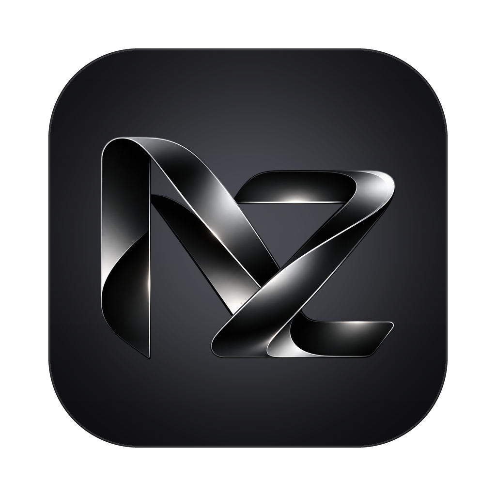

<p align="center"></p>

# NZAP Engine

**Your own Google Colab runtimes, from a native window.**

NZAP Engine is the open-source desktop edition of NZAP. It allocates and drives
the Colab VMs that belong to _your_ Google account (CPU, GPU and TPU) and gives
you a console, a real terminal, a file manager, parameterised notebooks and
ephemeral jobs. There is no server, no NZAP account and no database: install one
package and connect Google.

> **Status: pre-release.** Every feature is built and tested against a mock
> of Google's services on Windows, macOS and Linux. The first release follows
> a pass of the [live checklist](./docs/TESTING.md#live-verification-checklist)
> against real Colab. [PLAN.md](./PLAN.md) has the design and the history.

## Install

Download the installer for Windows, macOS or Linux from
[Releases](https://github.com/nzap-labs/nzap-engine/releases), open it, and
click **Connect Google**. [docs/INSTALL.md](./docs/INSTALL.md) covers each OS
and unsigned-build warnings.

## What it does

- **Apps.** One-click AI apps such as Kokoro and Breeze text to speech: a real
  form, the runtime each one needs, how long setup and every run take, and
  results as audio, images or tables. The model stays warm between runs.
  `nzap://apps/public:kokoro-tts` links (the website's "Open in NZAP Engine")
  open an app directly.
- **Connect Google once.** OAuth with PKCE in your browser. The refresh token
  stays in your OS keychain and never reaches the UI.
- **Runtimes.** Assign CPU / T4 / L4 / G4 / A100 / H100 / TPU v5e / v6e, with
  optional High-RAM, then keep them alive, restart, interrupt and release them.
  Runtimes created elsewhere can be imported.
- **Console.** Streaming cell output, `input()` prompts, and Drive / Google Cloud
  consent that pauses the cell and resumes it after you approve.
- **Setup.** Install packages (uv → pip), mount Drive, authenticate Google Cloud.
- **Terminal.** A real shell on the VM.
- **Files.** Browse, edit, upload, download, rename, create and delete.
- **Run.** Run a local `.py`/`.ipynb` (or a Colab / Drive / GitHub link) and get
  the executed notebook back, or launch an ephemeral job that allocates a fresh VM,
  runs a script, returns its artifacts and releases the VM.
- **Notebooks.** A public collection hosted on GitHub
  ([nzap-labs/nzap-notebooks](https://github.com/nzap-labs/nzap-notebooks)) plus
  your own private notebooks, all with typed parameters.
- **AI agents (MCP).** Claude Code, Claude Desktop, Cursor and other MCP
  clients can use your runtimes: `nzap-engine mcp` lets an agent start and stop
  VMs, run code, move files and run the apps, for example speech to text or
  ffmpeg without installing anything locally. Settings shows the one-line setup.
- **Compute units.** Burn rate, free time left and low-balance alerts.
- **History.** Every cell and operation, exportable as `.ipynb`, `.md`, `.txt`
  or `.jsonl`.

## How it works

```
NZAP Engine (one process)
├─ WebView: React UI  ──IPC──►  Tauri shell  ──►  nzap-core (Rust)
└──────────────────────────────────────────────────────┬───────────
                                        HTTPS / WSS to Google Colab,
                                        your runtimes, Drive, GitHub

AI agent ──stdio (MCP)──►  nzap-engine mcp  ──►  nzap-mcp ──► nzap-core
```

The engine is a Rust port of `colab-studio`, which speaks the same wire protocol
as Google's own `google-colab-cli` and the Colab VS Code extension.

## Documentation

| Guide                                           | For                                             |
| ----------------------------------------------- | ----------------------------------------------- |
| [INSTALL.md](./docs/INSTALL.md)                 | installing, where data lives, uninstalling      |
| [OAUTH.md](./docs/OAUTH.md)                     | how sign-in works, using your own OAuth client  |
| [NOTEBOOKS.md](./docs/NOTEBOOKS.md)             | parameters, writing and contributing notebooks  |
| [MCP.md](./docs/MCP.md)                         | connecting AI agents (Claude Code and others)   |
| [TROUBLESHOOTING.md](./docs/TROUBLESHOOTING.md) | common problems                                 |
| [ARCHITECTURE.md](./docs/ARCHITECTURE.md)       | how the pieces fit, IPC conventions             |
| [TESTING.md](./docs/TESTING.md)                 | the test suites and the live checklist          |
| [RELEASING.md](./docs/RELEASING.md)             | cutting releases, signing, enabling auto-update |
| [SECURITY.md](./SECURITY.md)                    | threat model and reporting vulnerabilities      |

## Development

Prerequisites: Node 22+, the Rust stable toolchain, and the
[Tauri system dependencies](https://v2.tauri.app/start/prerequisites/) for your OS.

```bash
npm install
npm run app:dev      # desktop app with hot reload
npm run dev          # the UI in a browser, against a simulated engine
```

`npm run dev` needs no Rust toolchain or Google account: in a plain browser the
UI talks to `src/dev/fake-engine.ts`, which imitates the engine (including a
Colab kernel, a terminal and Drive consent), and `window.__NZAP_FAKE__` lets you
change its state. Production builds never include it.

| Command                                                 | What it does                        |
| ------------------------------------------------------- | ----------------------------------- |
| `npm run lint` / `typecheck` / `test`                   | frontend checks and component tests |
| `npx playwright test`                                   | web E2E (Chromium + WebKit)         |
| `npm run build`                                         | production frontend bundle          |
| `npm run app:build`                                     | installers for the current OS       |
| `cargo test --workspace`                                | engine unit and integration tests   |
| `cargo clippy --workspace --all-targets -- -D warnings` | Rust lints                          |
| see [`e2e/desktop`](./e2e/desktop/README.md)            | desktop E2E against the real app    |

Layout: `src/` (React UI), `src-tauri/` (desktop shell), `crates/nzap-core`
(the engine), `crates/nzap-mock-colab` (mock Google services for tests), `e2e/`.

## Disclaimer

NZAP Engine is not affiliated with or endorsed by Google. It uses the same
endpoints as Google's Colab clients, and those are internal APIs that may
change without notice. Your use of Colab is governed by Google's terms.

## License

[Apache-2.0](./LICENSE)
